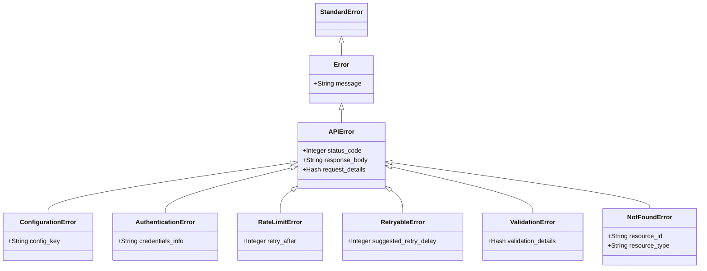

# Langfuse Error Hierarchy Implementation Plan

This document outlines the implementation plan for the custom error hierarchy in the Langfuse Ruby SDK, addressing backlog item 3.3.

## 1. Error Hierarchy

We'll create a new file `lib/langfuse/errors.rb` with the following error classes:

```ruby
# frozen_string_literal: true
# typed: strict

require 'sorbet-runtime'

module Langfuse
  # Base error class for all Langfuse-related errors
  class Error < StandardError; end
  
  # Error related to API communication issues
  class APIError < Error
    extend T::Sig
    
    sig { returns(T.nilable(Integer)) }
    attr_reader :status_code
    
    sig { returns(T.nilable(String)) }
    attr_reader :response_body
    
    sig { returns(T.nilable(T::Hash[Symbol, T.untyped])) }
    attr_reader :request_details
    
    sig do
      params(
        message: T.nilable(String),
        status_code: T.nilable(Integer),
        response_body: T.nilable(String),
        request_details: T.nilable(T::Hash[Symbol, T.untyped])
      ).void
    end
    def initialize(message = nil, status_code: nil, response_body: nil, request_details: nil)
      @status_code = status_code
      @response_body = response_body
      @request_details = request_details
      super(message)
    end
  end
  
  # Error related to configuration issues
  class ConfigurationError < APIError; end
  
  # Error related to authentication or authorization issues
  class AuthenticationError < APIError; end
  
  # Error related to rate limiting
  class RateLimitError < APIError
    extend T::Sig
    
    sig { returns(T.nilable(Integer)) }
    attr_reader :retry_after
    
    sig do
      params(
        message: T.nilable(String),
        retry_after: T.nilable(Integer),
        status_code: T.nilable(Integer),
        response_body: T.nilable(String),
        request_details: T.nilable(T::Hash[Symbol, T.untyped])
      ).void
    end
    def initialize(message = nil, retry_after: nil, status_code: nil, response_body: nil, request_details: nil)
      @retry_after = retry_after
      super(message, status_code: status_code, response_body: response_body, request_details: request_details)
    end
  end
  
  # Error that can be retried
  class RetryableError < APIError; end
  
  # Error related to validation issues
  class ValidationError < APIError; end
  
  # Error when a resource is not found
  class NotFoundError < APIError; end
end
```

## 2. Integration with ApiClient

We'll update `lib/langfuse/api_client.rb` to use our new error classes:

```ruby
# In the ingest method, replace the current error handling with:

begin
  response = http.request(request)
  
  result = T.let(nil, T.nilable(T::Hash[String, T.untyped]))
  
  case response.code.to_i
  when 200..299
    log("Received successful response: #{response.code}") if @config.debug
    result = JSON.parse(response.body)
  when 207 # Partial success
    log('Received 207 partial success response') if @config.debug
    result = JSON.parse(response.body)
  when 401, 403
    raise AuthenticationError.new(
      "Authentication failed: #{response.message}",
      status_code: response.code.to_i,
      response_body: response.body,
      request_details: { url: uri.to_s, method: 'POST' }
    )
  when 404
    raise NotFoundError.new(
      "Resource not found: #{response.message}",
      status_code: response.code.to_i,
      response_body: response.body,
      request_details: { url: uri.to_s, method: 'POST' }
    )
  when 422
    raise ValidationError.new(
      "Validation error: #{response.message}",
      status_code: response.code.to_i,
      response_body: response.body,
      request_details: { url: uri.to_s, method: 'POST' }
    )
  when 429
    retry_after = response['Retry-After']&.to_i
    raise RateLimitError.new(
      "Rate limit exceeded. Retry after #{retry_after || 'unknown'} seconds.",
      retry_after: retry_after,
      status_code: response.code.to_i,
      response_body: response.body,
      request_details: { url: uri.to_s, method: 'POST' }
    )
  when 400..499
    raise APIError.new(
      "API client error: #{response.code} #{response.message}",
      status_code: response.code.to_i,
      response_body: response.body,
      request_details: { url: uri.to_s, method: 'POST' }
    )
  when 500..599
    raise RetryableError.new(
      "API server error: #{response.code} #{response.message}",
      status_code: response.code.to_i,
      response_body: response.body,
      request_details: { url: uri.to_s, method: 'POST' }
    )
  else
    raise APIError.new(
      "Unexpected API response: #{response.code} #{response.message}",
      status_code: response.code.to_i,
      response_body: response.body,
      request_details: { url: uri.to_s, method: 'POST' }
    )
  end
  
  result
rescue Net::OpenTimeout, Net::ReadTimeout => e
  raise RetryableError.new(
    "Request timeout: #{e.message}",
    request_details: { url: uri.to_s, method: 'POST' }
  )
rescue Errno::ECONNREFUSED, Errno::ECONNRESET => e
  raise RetryableError.new(
    "Connection error: #{e.message}",
    request_details: { url: uri.to_s, method: 'POST' }
  )
rescue JSON::ParserError => e
  raise APIError.new(
    "Invalid JSON response: #{e.message}",
    response_body: response&.body,
    request_details: { url: uri.to_s, method: 'POST' }
  )
rescue StandardError => e
  log("Error during API request: #{e.message}", :error)
  raise
end
```

## 3. Integration with BatchWorker

We'll update `lib/langfuse/batch_worker.rb` to handle our new error types:

```ruby
# In the Sidekiq worker's perform method:

begin
  response = api_client.ingest(event_hashes)
  
  # Check for partial failures using standard hash access
  errors = T.let(response['errors'], T.nilable(T::Array[T::Hash[String, T.untyped]]))
  if errors && errors.any?
    errors.each do |error|
      T.unsafe(self).logger.error("Langfuse API error for event #{error['id']}: #{error['message']}")
      
      # Store permanently failed events if needed
      next if retryable_error?(error)
      
      # Find the failed event
      failed_event = event_hashes.find { |e| T.unsafe(e)[:id] == error['id'] }
      if failed_event
        store_failed_event(failed_event, T.cast(error['message'], String))
      end
    end
  end
rescue Langfuse::RateLimitError => e
  # Special handling for rate limits
  retry_after = e.retry_after || 30 # Default to 30 seconds if not specified
  T.unsafe(self).logger.warn("Langfuse rate limit exceeded. Retrying in #{retry_after} seconds.")
  
  # Requeue the job with a delay based on retry_after
  # This is Sidekiq-specific and would need adjustment for other job processors
  T.unsafe(self.class).perform_in(retry_after, event_hashes)
rescue Langfuse::RetryableError => e
  # Let Sidekiq handle the retry for other retryable errors
  T.unsafe(self).logger.error("Langfuse retryable error: #{e.message}")
  raise
rescue Langfuse::APIError => e
  # Non-retryable API errors
  T.unsafe(self).logger.error("Langfuse API error: #{e.message}")
  
  # Store all events as failed
  event_hashes.each do |event|
    store_failed_event(event, e.message)
  end
rescue StandardError => e
  # Other unexpected errors
  T.unsafe(self).logger.error("Langfuse unexpected error: #{e.message}")
  raise
end

# Replace non_retryable_error? with:
sig { params(error: T::Hash[String, T.untyped]).returns(T::Boolean) }
def retryable_error?(error)
  # Check if this is a retryable error based on status code
  status = T.let(error['status'], T.untyped)
  status_int = T.let(status.to_i, Integer)
  
  # 429 (rate limit) and 5xx (server errors) are retryable
  status_int == 429 || status_int >= 500
end
```

## 4. Integration with Client

We'll update `lib/langfuse/client.rb` to validate configuration and raise appropriate errors:

```ruby
# In the initialize method:

def initialize
  @config = T.let(Langfuse.configuration, ::Langfuse::Configuration)
  
  # Validate configuration
  validate_configuration!
  
  # Rest of the initialization code...
end

# Add a private method for configuration validation:
private

sig { void }
def validate_configuration!
  if @config.public_key.nil? || @config.public_key.empty?
    raise ConfigurationError.new('Missing public_key in Langfuse configuration')
  end
  
  if @config.secret_key.nil? || @config.secret_key.empty?
    raise ConfigurationError.new('Missing secret_key in Langfuse configuration')
  end
  
  if @config.host.nil? || @config.host.empty?
    raise ConfigurationError.new('Missing host in Langfuse configuration')
  end
end
```

## 5. Update Main Langfuse Module

Update `lib/langfuse.rb` to require our new errors file:

```ruby
# Add this line after the other requires:
require 'langfuse/errors'
```

## Implementation Sequence

1. Create `lib/langfuse/errors.rb` first
2. Update `lib/langfuse.rb` to require the new file
3. Update `ApiClient` to use the new error classes
4. Update `BatchWorker` to handle the new error types
5. Update `Client` for configuration validation

## Testing Strategy

We should create tests for:

1. **Error Classes**
   - Test that each error class captures the right information
   - Test inheritance relationships
   - Test that additional attributes (like `retry_after` in `RateLimitError`) work correctly

2. **ApiClient**
   - Mock HTTP responses with different status codes
   - Verify the correct error type is raised for each status code
   - Test handling of network errors (timeouts, connection refused)
   - Test handling of malformed responses

3. **BatchWorker**
   - Test handling of different error types
   - Verify retry behavior for `RateLimitError` and `RetryableError`
   - Test that non-retryable errors are stored in the dead letter queue
   - Test partial success handling

4. **Client**
   - Test configuration validation
   - Verify appropriate `ConfigurationError` is raised for missing or invalid configuration

## Error Hierarchy Diagram



## Error Flow Diagram


## Benefits

1. **More Precise Error Handling:** Callers can catch specific error types rather than checking error messages or status codes.

2. **Better Diagnostics:** Each error type includes relevant contextual information.

3. **Improved Retry Logic:** `BatchWorker` can make smarter decisions based on error type.

4. **Future Extensibility:** New error types can be added as the API evolves.

5. **Developer Experience:** Clear error types with meaningful names make the gem easier to use and debug.